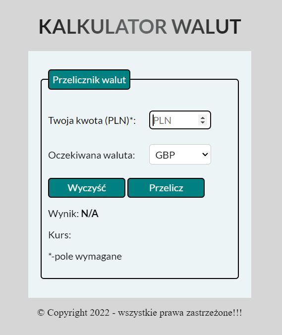
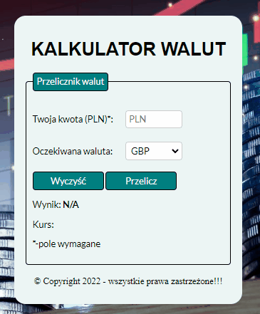

# 💰 currency-converter
This is one of my first projects that I made as part of the frontend developer course. The project contains demos of a simple currency calculator.

## 🌎 DEMO:
https://pawelmajka.github.io/currency-converter/

## 📋 Description
This simple site presents a simle currency calculator. It calculates PLN to GBP/USD/EUR/PLN.

## 🔎 Prieview

## 💻 Tech Stack:
- HTML
- CSS
- JavaScript
- BEM convension
- normalize.css
